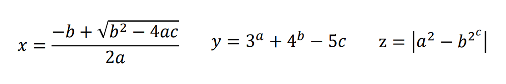
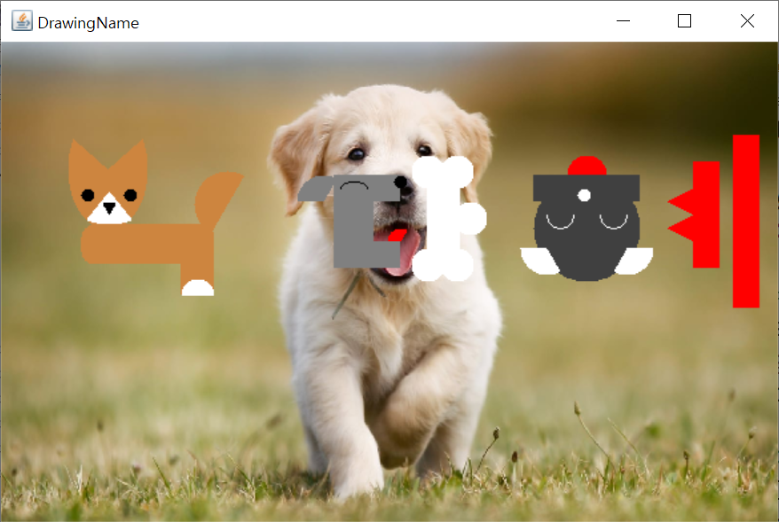

# :bulb: OOP:bulb:  
2016 객체지향프로그래밍. java programming  

### PerfectNumber  
**1. 정의**    
1~10000사이의 완전수(Perfect number)를 구하는 프로그램.  
> 완전수(Perfect number)란?  
자기 자신을 제외한 약수의 합이 자기 자신과 같은 수이다.  
예) 6 = 1 + 2 + 3    

**2. 출력**  
"완전수 = 약수의 합" 형식으로 출력    
```HTML
Perfect number 6 = 1 + 2 + 3  
Perfect number 28 = 1 + 2 + 4 + 7 + 14  
Perfect number 496 = 1 + 2 + 4 + 8 + 16 + 31 + 62 + 124 + 248  
Perfect number 8128 = 1 + 2 + 4 + 8 + 16 + 32 + 64 + 127 + 254 + 508 + 1016 + 2032 + 4064
```

### ArithmeticExpression  
**1. 정의**    
 a, b, c에 대한 세가지 산술식 x, y, z    
   
 CalcXYZ 클래스에 산술식 x, y, z를 계산하는 메소드 calcX(), calcY(), calcZ()를 구현.    

**2. 입력**  

a | b | c
---|---|---
3 | 4 | 5
1 | 3 | 2
2 | 4 | 1
0 | 8 | 9
2 | 7 | 2

**3. 출력**  
a, b, c 값에 대한 산술식 x, y, z를 계산하여 결과를 화면에 출력    
```HTML
(a, b, c)       calcX      calcY           calcZ

(3, 4, 5)       NaN        258.000      18446744073709552000.000
(1, 3, 2)    -1.000         57.000         80.000
(2, 4, 1)    -0.293        260.000         12.000
(0, 8, 9)       NaN      65492.000       Infinity
(2, 7, 2)    -0.314      16383.000       2397.000
```

### GregorianCalendar  
**1. 정의**  
날짜를 입력 받아 1900년 1월 1일부터의 날짜수와 그 날의 요일을 출력하는 프로그램.  
**2. 입력**  
1900-01-01이후의 날짜    
**3. 출력**  
```HTML
1900년 이후의 날짜 (year-month-day): 2020-12-09
1900-01-01부터 날짜수는 44173
2020-12-09의 요일은 수요일
```

### ReverseString  
**1. 정의**  
Stack구조를 구현, Stack을 이용해 주어진 Original 문자열의 글자 순서를 역순으로 뒤집어 Reverse 문자열을 출력.  
**2. 출력**  
```HTML
Original = "apple"
Reverse = "elppa"
Original = "banana"
Reverse = "ananab"
Original = "동해물과 백두산이"
Reverse = "이산두백 과물해동"
Original = "watermelon"
Reverse = "nolemretaw"
Original = "grapefruit"
Reverse = "tiurfeparg"
```

### FigureEditor  
**1. 정의**  
메뉴 입력을 통해 도형을 추가하는 프로그램. 추상 클래스 Figure를 사용하고 클래스 상속구조를 따라 각 도형 클래스를 만든다. 여섯개의 도형 직사각형, 정사각형, 타원, 원, 이등변삼각형, 정삼각형  
- 추상클래스 Figure  
```java
// 도형 추상 클래스
abstract class Figure {
    double width, height;       // 가로, 세로
    abstract double getArea();  // 넓이 구하기
    abstract double getGirth(); // 둘레 구하기
}
```
- 상속 구조  
  

**2. 입력**  
- 메뉴입력  
- 도형의 가로, 세로 길이  

**3. 출력**  
```HTML
Clo-udhye의 도형 편집기 □○△ 메뉴
 [1] = 직사각형 추가, [2] = 타원 추가, [3] = 이등변삼각형 추가,
 [4] = 정사각형 추가, [5] = 원 추가, [6] = 정삼각형 추가, [0] = 종료
메뉴 선택? 1
직사각형의 가로, 세로? 200 100
0 : 직사각형 (너비 = 200.0, 높이 = 100.0, 넓이 = 20000.0, 둘레 = 600.0)

Clo-udhye의 도형 편집기 □○△ 메뉴
 [1] = 직사각형 추가, [2] = 타원 추가, [3] = 이등변삼각형 추가,
 [4] = 정사각형 추가, [5] = 원 추가, [6] = 정삼각형 추가, [0] = 종료
메뉴 선택? 2
타원의 가로지름, 세로지름? 200 100
0 : 직사각형 (너비 = 200.0, 높이 = 100.0, 넓이 = 20000.0, 둘레 = 600.0)
1 : 타원 (너비 = 200.0, 높이 = 100.0, 넓이 = 15708.0, 둘레 = 496.7)
```

### DrawingName  
**1. 정의**  
java.awt 패키지에서 제공하는 다양한 도형을 사용하여 본인의 이름을 예쁘게 그리시오.  
**2. 출력**  
  

### MyList  
**1. 정의**  
- 제네릭 인테페이스 ListInterface를 구현하는 제네릭 클래스 MyList를 작성.   
```java
interface ListInterface<T> {
    void add(T obj);        // 리스트의 끝에 obj 추가
    void delete(int index); // index번째 obj 삭제
    T getAt(int index);     // index번째 obj 리턴
    int getSize();          // 리스트의 크기 리턴
}
```
- main() 메소드에서 리스트 추가/제거 기능을 구현.  
- 지역변수로 Integer형에 대한 MyList 객체를 생성하여 리스트를 관리한다.  
- 제거 메뉴에서 유효하지 않은 index 값이 입력된 경우 사용자 정의 예외를 발생시킨다.  

**2. 입력**  
- 메뉴 입력  
- 숫자, 인덱스 입력  

**3. 출력**  
```HTML
메뉴 선택 (1=추가 , 2=제거, 3=출력, 0=종료)? 1
숫자? 1
[0] 1 
 
메뉴 선택 (1=추가 , 2=제거, 3=출력, 0=종료)? 1
숫자? 2
[1] 2 
 
메뉴 선택 (1=추가 , 2=제거, 3=출력, 0=종료)? 3
[0] 1 [1] 2  
 
메뉴 선택 (1=추가 , 2=제거, 3=출력, 0=종료)? 2
인덱스? 2
잘못된 인덱스 오류!
 
메뉴 선택 (1=추가 , 2=제거, 3=출력, 0=종료)? 2
인덱스? 0
 
메뉴 선택 (1=추가 , 2=제거, 3=출력, 0=종료)? 3
[0] 2  
 
메뉴 선택 (1=추가 , 2=제거, 3=출력, 0=종료)? 0
 
MyList 프로그램을 종료합니다.
```

### ElectronicCalculator  
**1. 정의**  
전자계산기를 구현.  
- 사칙 연산 기능은 일반적인 전자계산기 동작을 참고한다.  
- 숫자 편집 버튼  
    - [C] 전체 식 초기화  
    - [CE] 현재 입력중인 숫자 초기화  
    - [<] 숫자 한글자 지우기  

**2. 출력**  
  

### DrawingBox  
**1. 정의**  
마우스를 드래깅하여 사각형을 그리는 프로그램을 작성.  
- 시작점을 기준으로 어떤 방향으로 움직이더라도 시작점과 끝점을 꼭지점으로 하는 직사각형이 그려지도록 한다.  
- 새로운 사각형을 그릴 때 마다 랜덤으로 한가지 색을 정하여 사각형 내부를 칠한다. 단, 테두리는 항상 빨간색으로 그려져야 한다.  

**2. 출력**  
  
